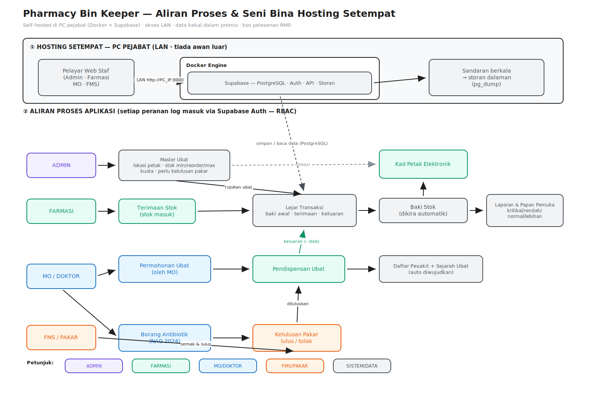
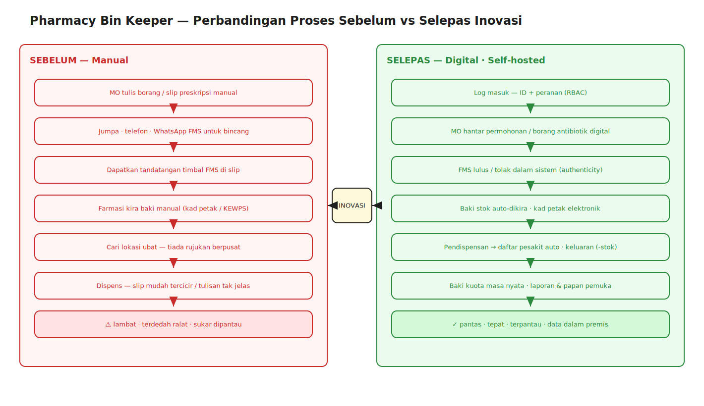

# PROJEK INOVASI — KATEGORI PROSES

# Pharmacy Bin Keeper *(e‑Kad Petak Farmasi)*

> **Cara guna dokumen ini:** Teks di dalam tanda kurung siku seperti `[NAMA INOVASI]`,
> `[FASILITI]`, `[KUMPULAN]`, `[DAERAH]`, `[NEGERI]`, `[NAMA AHLI]`, `[TARIKH]` dan
> `[NO MyIPO]` adalah ruang isian. Gantikan dengan butiran sebenar fasiliti anda sebelum
> dihantar. Struktur dokumen ini mengikut format penulisan **Projek Inovasi (Kategori Proses)**
> yang sama dengan contoh *One‑Click A/KK* supaya boleh disertakan dalam pertandingan yang sama.
>
> **Nota teknikal utama (pembeza inovasi ini):** Sistem ini **dihoskan secara setempat (self‑hosted)
> di PC pejabat** menggunakan **Docker** untuk menjalankan **Supabase** (pangkalan data PostgreSQL +
> pengesahan pengguna) di dalam rangkaian dalaman (LAN) fasiliti — **tiada pergantungan kepada
> pelayan luar atau internet awam**, kos pelesenan **RM0**, dan **data pesakit kekal di dalam premis**.

---

## I. ISI KANDUNGAN

| BIL | TAJUK | MUKA SURAT |
|-----|-------|------------|
| | Abstrak | iv |
| 1.0 | Pengenalan | 1 |
| | 1.1 Pengenalan Mengenai Agensi | 1 |
| | 1.2 Pengenalan Inovasi | 1 |
| | &nbsp;&nbsp;&nbsp;1.2.1 Penerangan Inovasi | 1 |
| | &nbsp;&nbsp;&nbsp;1.2.2 Butiran Inovasi | 3 |
| 2.0 | Sebelum dan Selepas Inovasi Dihasilkan | 5 |
| | 2.1 Keadaan Sebelum Inovasi | 5 |
| | 2.2 Keadaan Selepas Inovasi | 6 |
| | 2.3 Faedah‑Faedah daripada Inovasi | 6 |
| 3.0 | Kriteria Penilaian | 11 |
| | 3.1 Impak Tinggi | 11 |
| | 3.2 Ciri‑Ciri Inovasi (Kreativiti) | 12 |
| | 3.3 Efisien | 13 |
| | 3.4 Replikasi | 15 |
| | 3.5 Komitmen Pengurusan Atasan | 15 |
| 4.0 | Kesimpulan | 15 |
| | Lampiran | 16 |

---

## ABSTRAK

### Pharmacy Bin Keeper *(e‑Kad Petak Farmasi)*

*[NAMA AHLI 1], [NAMA AHLI 2], [NAMA AHLI 3], … [KUMPULAN], [FASILITI], [DAERAH], [NEGERI].*

**PENDAHULUAN** Pharmacy Bin Keeper merupakan inovasi proses yang diperkenalkan oleh Unit Farmasi
[FASILITI]. Pengurusan stok ubat di farmasi memerlukan kawalan baki, lokasi penyimpanan (petak/bin),
serta pemantauan ubat berkuota dan berkategori kelulusan pakar. **PENJELASAN KATEGORI INOVASI**
Pharmacy Bin Keeper merupakan inovasi proses yang memberi fokus kepada penambahbaikan proses kerja
pengurusan inventori dan pendispensan ubat. Ia mengintegrasikan kad petak elektronik (electronic bin card),
lejar stok, permohonan ubat oleh pegawai perubatan, kelulusan antibiotik oleh pakar, serta pemantauan kuota
ke dalam satu sistem digital tunggal. **MASALAH SEBELUM INOVASI** Pengurusan stok dan lokasi ubat
dilakukan secara manual menggunakan kad petak fizikal (KEWPS) dan borang bertulis. Sistem manual ini
menyukarkan pengiraan baki semasa secara tepat, mudah tertinggal/terhilang, dan tiada pandangan masa nyata
(real‑time) terhadap baki kuota. **KEADAAN SEBELUM INOVASI** Anggota farmasi perlu mengira baki secara
manual, mencari lokasi ubat tanpa rujukan berpusat, dan menggunakan kaedah konvensional (telefon/WhatsApp)
untuk menyelaras permohonan ubat. **PENERANGAN PROJEK INOVASI** Pharmacy Bin Keeper ialah satu
aplikasi web yang dibangunkan secara dalaman (in‑house) bagi mengurus master ubat, lokasi petak, lejar stok,
permohonan dan kelulusan ubat secara digital. **CIRI PEMBEZA UTAMA** Sistem ini **dihoskan sepenuhnya
secara setempat di PC pejabat** menggunakan **Docker** untuk menjalankan **Supabase** dalam rangkaian
dalaman fasiliti, menjadikan data pesakit kekal di premis tanpa pergantungan kepada perkhidmatan awan luar.
**KEADAAN SELEPAS INOVASI** Baki stok dikira secara automatik daripada lejar transaksi, lokasi petak setiap
ubat boleh dirujuk serta‑merta, dan setiap pengguna mempunyai ID serta peranan (admin/farmasi/pegawai
perubatan/pakar) bagi kawalan akses. **ANGGARAN KOS** Dibangunkan secara in‑house dan dihoskan di
perkakasan sedia ada menggunakan perisian sumber terbuka. Kos pelesenan adalah **RM 0**.

*([ISI BILANGAN] Patah Perkataan)*

---

## 1.0 PENGENALAN

### 1.1 PENGENALAN MENGENAI AGENSI

[FASILITI] adalah komited untuk meningkatkan tahap kesihatan penduduk dengan memberikan perkhidmatan
kesihatan yang optima, menyokong hala tuju strategik Kementerian Kesihatan Malaysia (KKM) berdasarkan
piawaian MS ISO 9001:2015, mengikut keperluan undang‑undang dan peraturan, serta penambahbaikan
berterusan bagi meningkatkan kepuasan pelanggan.

Unit yang terlibat dalam inovasi ini ialah **Unit Farmasi [FASILITI]**, yang terdiri daripada Pegawai Farmasi
dan Penolong Pegawai Farmasi. Unit ini bertanggungjawab dalam **penyaringan, penyediaan, penyimpanan,
pengurusan stok dan pendispensan ubat** yang dipreskrib kepada pesakit. Inovasi ini turut melibatkan Pakar
Perubatan Keluarga (FMS) dan Pegawai Perubatan (MO) yang bertugas di fasiliti. Inovasi Pharmacy Bin Keeper
dihasilkan oleh **[KUMPULAN]** (Lampiran 1a, 1b), terdiri daripada individu yang komited, kreatif dan inovatif
dalam membangunkan penyelesaian yang sejajar dengan misi, visi dan piagam pelanggan jabatan. (Lampiran 2)

### 1.2 PENGENALAN INOVASI

#### 1.2.1 PENERANGAN INOVASI

Pengurusan inventori farmasi melibatkan beberapa cabaran serentak: memastikan baki stok tepat, mengetahui
**lokasi fizikal** setiap ubat di stor (seksyen gudang, baris, rak, tingkat dan petak), memantau ubat **berkuota**,
dan menguruskan ubat yang memerlukan **kelulusan pakar** (contohnya antibiotik mengikut *Clinical Pathway*
NAG 2024 atau ubat kategori A/KK mengikut FUKKM).

Setiap ubat di dalam **Formulari Ubat Kementerian Kesihatan Malaysia (FUKKM)** mempunyai kategori
preskriber tersendiri yang menggariskan siapa yang boleh mempreskrib ubat tersebut:

| Kategori Preskriber | Preskriber |
|--------------------|------------|
| A* | Pakar Perunding / Pakar bagi Indikasi Spesifik Sahaja |
| A | Pakar Perunding / Pakar |
| A/KK | Pakar Perunding / Pakar / Pakar Perubatan Keluarga |
| B | Pakar Perunding / Pakar / FMS / Pegawai Perubatan |
| C | Pakar Perunding / Pakar / FMS / Pegawai Perubatan / Anggota Paramedik |
| C+ | … / Anggota Paramedik Perbidanan |

*Rajah 1: Kategori Preskriber*

Bagi memastikan tadbir urus ubat yang efisien dan rasional, pelbagai kaedah diadaptasi unit farmasi di seluruh
Malaysia — kebanyakannya masih **manual** (kad petak fizikal/KEWPS, borang bertulis, tandatangan timbal).
Kaedah manual ini menimbulkan masalah ketepatan data, kesukaran pemantauan masa nyata, dan risiko
dokumen tercicir.

Kajian dalaman terhadap proses kerja Unit Farmasi [FASILITI] *(Lampiran 3)* mendapati:

- Pengiraan baki stok dibuat secara manual dan terdedah kepada ralat *(isi peratus: [__]%)*.
- Lokasi ubat di stor tiada rujukan berpusat, melambatkan proses pengisian dan pendispensan.
- Pemantauan ubat berkuota tidak masa nyata; preskriber perlu menghubungi farmasi untuk semakan baki.
- Permohonan dan kelulusan ubat terkawal bergantung kepada kaedah konvensional (telefon/WhatsApp/borang).

Justeru, kumpulan ini membangunkan **Pharmacy Bin Keeper**, sebuah inovasi proses berasaskan web yang
dibangunkan secara **in‑house** dan **dihoskan setempat di PC pejabat**. Sistem ini mempunyai empat (4)
kategori pengguna utama, masing‑masing dengan peranan (*role*) dan kawalan akses tersendiri:

1. **Admin** — Menguruskan master ubat, kuota tahunan, peranan pengguna dan kelancaran operasi sistem.
2. **Pegawai Farmasi / Penolong Pegawai Farmasi** — Mengurus terimaan stok, kad petak, pendispensan dan laporan.
3. **Pegawai Perubatan (MO)** — Membuat permohonan ubat dan borang antibiotik secara digital.
4. **Pakar Perubatan Keluarga (FMS) / Pakar** — Meluluskan permohonan antibiotik dan ubat berkategori kelulusan pakar.

Dengan pelaksanaan sistem ini, proses kerja farmaseutikal menjadi lebih cekap, telus dan komprehensif —
sekali gus meningkatkan kecekapan pengurusan ubat serta mengurangkan masa menunggu pesakit.

**Fungsi‑fungsi utama sistem:**

| Modul | Fungsi |
|-------|--------|
| **Master Ubat (Drug Master)** | Pendaftaran ubat: nama, kod, unit pengukuran, kumpulan, lokasi penuh (gudang/baris/rak/tingkat/petak), stok min/reorder/max, penanda perlu kelulusan pakar. |
| **Kad Petak Elektronik (Bin Card)** | Paparan pergerakan stok setiap ubat mengikut lokasi petak — menggantikan kad petak fizikal KEWPS. |
| **Lejar Ubat (Ledger) & Terimaan** | Semua pergerakan inventori (baki awal / terimaan / keluaran) direkod dalam lejar; **baki stok dikira automatik** daripada lejar — tiada lajur stok berasingan. |
| **Permohonan Ubat (Dispensing Request)** | Aliran MO → Farmasi: *pending → approved/rejected/fulfilled/deferred*. |
| **Borang Antibiotik** | Aliran MO → Pakar mengikut *Clinical Pathway* NAG 2024: *pending → approved/rejected → acknowledged*. |
| **Daftar Pesakit & Sejarah Ubat** | Daftar pesakit diwujudkan automatik semasa pendispensan; sejarah ubat pesakit terpaut. |
| **Kuota Ubat (Drug Quota)** | Kuota tahunan setiap ubat terkawal ditetapkan admin; baki kuota dipaparkan masa nyata. |
| **Laporan (Reports)** | Carta dan laporan stok, status kritikal/rendah/normal/lebihan, dan penggunaan. |
| **Pembantu AI + Log Audit** | Pembantu pertanyaan dengan jejak audit panggilan AI (pengguna, peranan, status, token) untuk akauntabiliti. |

#### 1.2.2 BUTIRAN‑BUTIRAN INOVASI

**i. Objektif Inovasi**

- a. Menyediakan pengiraan baki stok yang **tepat dan automatik** daripada lejar transaksi.
- b. Memudahkan **rujukan lokasi petak (bin)** setiap ubat bagi mempercepat pengisian dan pendispensan.
- c. Membolehkan **pemantauan ubat berkuota dan berkategori kelulusan pakar secara masa nyata**.
- d. Mengurangkan masa menunggu pesakit dan risiko kesilapan pengubatan.
- e. **Memastikan kedaulatan data (data sovereignty)** — data pesakit kekal di dalam premis fasiliti melalui *hosting* setempat.

**ii. Sesi Perbincangan Mengenai Inovasi**

Perkara yang dibincangkan merangkumi penghasilan aplikasi web dan *coding*, **seni bina hosting setempat
(Docker + Supabase di PC pejabat)**, keselamatan IT dan privasi data pesakit, fungsi sistem, kelebihan sistem
dalam mengatasi masalah sebelum inovasi, serta kajian maklum balas penggunaan daripada staf.

**iii. Proses Pembuatan Inovasi**

Ahli kumpulan membuat lakaran kasar sistem *(Lampiran 4a)* dan *wireframe* antara muka *(Lampiran 4b)*.
Reka bentuk pangkalan data *(Lampiran 4c)* dirangka mengikut keperluan modul (master ubat, transaksi,
permohonan, antibiotik, kuota, profil & peranan). **Tindanan teknologi (technology stack)** yang digunakan:

| Lapisan | Teknologi |
|---------|-----------|
| Antara muka (frontend) | React 18 + TypeScript + Vite, shadcn/ui (Radix UI + Tailwind CSS) |
| Pengurusan data | TanStack React Query, React Hook Form + Zod |
| Backend & pangkalan data | **Supabase (PostgreSQL + Auth)** — **dihoskan sendiri melalui Docker** |
| Hosting | **PC pejabat dalam rangkaian dalaman (LAN) fasiliti** |
| Carta & laporan | Recharts |

Evolusi prototaip dari prototaip 1 hingga prototaip akhir ditunjukkan dalam *Rajah 2*.

> **Seni bina hosting setempat (Rajah 3):** Supabase dijalankan sebagai set kontena **Docker** di PC pejabat.
> Aplikasi web dilayari oleh pengguna dalam fasiliti melalui pelayar web pada rangkaian dalaman (LAN).
> Kesemua data — master ubat, transaksi stok, rekod pesakit dan kelulusan — disimpan dalam pangkalan data
> PostgreSQL setempat. **Tiada data dihantar ke pelayan awan luar.** Salinan sandar (backup) pangkalan data
> dibuat secara berkala ke storan dalaman fasiliti.



*Rajah 3: Seni bina hosting setempat (Docker + Supabase di PC pejabat) dan aliran proses aplikasi
merentas peranan (Admin, Farmasi, MO, FMS). Fail boleh sunting: `pharmacy-bin-keeper-flow.excalidraw`.*

*(Pilihan) Projek boleh didaftarkan dengan Perbadanan Harta Intelek Malaysia (MyIPO) di bawah kategori
hak cipta — [NO MyIPO] (Lampiran 5).*

**iv. Implikasi Kewangan**

Projek tidak memerlukan peruntukan kewangan yang besar. Ia dibangunkan secara in‑house dan dihoskan pada
**perkakasan sedia ada (PC pejabat)** menggunakan **perisian sumber terbuka** (Docker, Supabase, PostgreSQL).
Tiada kos pelesenan perisian dan **tiada yuran langganan awan bulanan**. **Kos pelesenan: RM 0.** Ini menjadikan
projek satu model inovasi kos rendah berimpak tinggi yang turut menjana penjimatan jangka panjang dalam kos
operasi, masa dan tenaga kerja.

**v. Lokasi Pelaksanaan**

Projek dilaksanakan di **[FASILITI]**, dengan potensi penyeragaman ke fasiliti lain *(Lampiran 6, 7)*.

**vi. Tarikh Produk Inovasi Dihasilkan**

[TARIKH]

**vii. Tempoh Pelaksanaan**

Masih digunapakai sehingga kini.

**viii. Bilangan Anggota Terlibat dalam Pelaksanaan**

Semua Pegawai Farmasi, Penolong Pegawai Farmasi, Pegawai Perubatan dan Pakar Perubatan Keluarga di [FASILITI].

---

## 2.0 SEBELUM DAN SELEPAS INOVASI DIHASILKAN



*Rajah 3a: Ringkasan perbandingan proses kerja sebelum (manual) dan selepas (digital, self‑hosted)
pelaksanaan Pharmacy Bin Keeper. Fail boleh sunting: `sebelum-selepas.excalidraw`.*

### 2.1 KEADAAN SEBELUM INOVASI

Anggota farmasi menguruskan stok dan lokasi ubat menggunakan **kad petak fizikal (KEWPS)** serta borang
bertulis. Permohonan dan kelulusan ubat terkawal pula bergantung kepada pertemuan bersemuka, panggilan
telefon dan mesej. Proses kerja ini mempunyai beberapa kekurangan *(Lampiran 8)*:

- a. **Pengiraan baki manual** terdedah kepada ralat dan tidak masa nyata.
- b. **Lokasi ubat tiada rujukan berpusat** — melambatkan proses cari, isi dan dispens ubat.
- c. **Kad petak/borang fizikal boleh tercicir atau hilang**, menyukarkan pemantauan penggunaan ubat.
- d. **Tiada pandangan masa nyata baki kuota** — preskriber perlu menghubungi farmasi untuk semakan.
- e. **Tulisan tangan kurang jelas** pada borang meningkatkan risiko kesilapan pengubatan.

*Rajah 4: Proses kerja lama menggunakan kad petak fizikal & borang manual.* Temu bual dijalankan terhadap
anggota farmasi, pegawai perubatan, FMS dan pesakit bagi mendalami *pain point* *(Lampiran 10)*. Daripada
proses *define*, didapati kesukaran pemantauan stok dan kuota, proses kerja tidak efisien, kurang ketelusan,
serta ketiadaan integrasi sistem yang mesra pengguna *(Lampiran 11)*.

### 2.2 KEADAAN SELEPAS INOVASI

Selepas pelaksanaan Pharmacy Bin Keeper:

- Anggota farmasi merekod terimaan/keluaran dalam lejar; **baki dikira automatik** dan dipapar serta‑merta.
- **Lokasi petak setiap ubat** boleh dirujuk di skrin dalam beberapa klik.
- Pegawai Perubatan membuat permohonan ubat dan borang antibiotik **secara digital**; status boleh disemak.
- Pakar/FMS **meluluskan atau menolak** permohonan terus dalam sistem, menjamin *authenticity* dan kawalan.
- Setiap pengguna mempunyai **ID dan peranan** masing‑masing bagi keselamatan dan kawalan akses.
- **Data kekal di dalam premis** — disimpan pada pangkalan data setempat di PC pejabat, bukan di awan luar.

Antara kelebihan aplikasi Pharmacy Bin Keeper:

- a. Berteknologi — pengisian dan semakan maklumat hanya di hujung jari.
- b. Tiada ketirisan maklumat; jejak audit lengkap.
- c. Mudah digunapakai dan mesra pengguna (antara muka shadcn/ui yang kemas).
- d. Maklumat disimpan dengan lebih selamat, setempat, dan mudah dirujuk kembali.

*Rajah 5: Antara muka Pharmacy Bin Keeper (Dashboard, Kad Petak, Laporan).*

### 2.3 FAEDAH‑FAEDAH DARIPADA INOVASI

> **Nota:** Angka di bawah adalah ruang isian *([__])* untuk diisi dengan data sebenar daripada kajian fasiliti
> anda (sebelum vs selepas), seperti dalam contoh One‑Click A/KK.

**i. Pengurangan Masa Menunggu Pesakit**
Pengiraan baki automatik dan rujukan lokasi petak yang pantas mengurangkan masa pengisian dan pendispensan
ubat. *(Sebelum: [__] minit → Selepas: [__] minit; penurunan [__]%.)* *(Lampiran 12)*

**ii. Pengurangan Risiko Kesilapan Pengubatan**
Sistem menghapuskan risiko kesilapan akibat tulisan tangan yang kurang jelas dan pengiraan baki manual.
Maklumat pesakit dan ubat dikunci secara digital, mengurangkan ralat transkripsi *(Lampiran 13)*.

**iii. Peningkatan Kepuasan Pesakit**
Masa menunggu yang lebih singkat mengurangkan aduan berkaitan perkhidmatan lambat *(Lampiran — Kajian
Kepuasan Pelanggan)*.

**iv. Peningkatan Kepuasan Pelanggan Dalaman (Staf)**
Kajian *self‑administered questionnaire* terhadap anggota farmasi dan preskriber menunjukkan kepuasan yang
lebih tinggi terhadap Pharmacy Bin Keeper berbanding kaedah manual *(Lampiran 14)*. *(Isi peratus: [__]%.)*

**v. Penjaminan Authenticity dan Kawalan Akses**
Setiap permohonan dan kelulusan direkod dengan ID pengguna dan cap masa. FMS/Pakar boleh memantau,
meluluskan atau menolak permohonan terus dalam sistem — menjamin *authenticity* perbincangan dan
penggunaan ubat terkawal yang berpatutan.

**vi. Pemantauan Ubat Berkuota yang Tepat**
Baki kuota tahunan setiap ubat terkawal dikemas kini dalam sistem dan boleh disemak masa nyata oleh
preskriber tanpa perlu menghubungi Unit Farmasi *(Lampiran 18)*.

**vii. Pengurangan Beban Kerja Anggota Farmasi**
Penghapusan pengiraan manual dan panggilan susulan membebaskan masa anggota farmasi untuk tugas teras
penyaringan, pengisian dan pendispensan.

**viii. Kedaulatan & Keselamatan Data (Faedah Pembeza Utama)**
Oleh kerana sistem **dihoskan setempat di PC pejabat melalui Docker/Supabase**, **tiada data pesakit
keluar dari premis fasiliti**. Ini:
- Mengelakkan pergantungan kepada perkhidmatan awan pihak ketiga dan yuran langganan.
- Membolehkan sistem **terus beroperasi walaupun tanpa internet** (dalam LAN dalaman).
- Memberi kawalan penuh ke atas privasi data pesakit selaras dengan prinsip perlindungan data.

**ix. Peningkatan Kualiti Hidup Pesakit**
Kawalan stok dan ubat yang lebih optima memastikan kesinambungan bekalan ubat pesakit, menyokong kawalan
penyakit yang lebih baik dan kualiti hidup yang lebih tinggi *(Lampiran 19)*.

---

## 3.0 KRITERIA PENILAIAN

### 3.1 IMPAK TINGGI

**IMPAK PELAKSANAAN YANG TINGGI DAN MELUAS**
Pharmacy Bin Keeper dilaksanakan di [FASILITI] dan menyumbang kepada pengurangan masa menunggu
pesakit, ketepatan baki stok, serta penghapusan kesilapan berpunca daripada proses manual. Inovasi ini
memberi manfaat kepada Unit Farmasi, Pegawai Perubatan, Pakar/FMS dan pesakit.

**MELIBATKAN KOLABORASI**
- **Unit Farmasi [FASILITI]** — penyediaan ubat, pengurusan stok dan pemantauan.
- **Pegawai Perubatan & FMS/Pakar** — pemohon dan pelulus ubat terkawal.
- **Unit ICT / Pasukan Pembangunan Dalaman** — pembangunan aplikasi, penyediaan *hosting* Docker dan keselamatan data.
- **Pengurusan [DAERAH/FASILITI]** — kelulusan dan sokongan pelaksanaan.

**WOW FAKTOR**
- **Hosting setempat *zero‑cloud*** — dibangunkan dan dihoskan sendiri di PC pejabat menggunakan Docker/Supabase, **tanpa kos pelesenan dan tanpa langganan awan**.
- **Kedaulatan data** — data pesakit tidak pernah meninggalkan premis fasiliti.
- **Beroperasi dalam LAN tanpa kebergantungan internet awam.**
- **Baki stok dikira automatik** daripada lejar transaksi (tiada lajur stok manual).
- **Sistem boleh direplikasi** ke fasiliti lain dengan memuat turun imej Docker yang sama — impak berpotensi nasional.

### 3.2 CIRI‑CIRI INOVASI (KREATIVITI)

**ASLI ATAU ADAPTASI**
Projek asli, dibangunkan sepenuhnya oleh **[KUMPULAN]** secara in‑house tanpa membeli sistem komersial.

- Penyelesaian digital bersepadu yang menggabungkan kad petak elektronik, lejar stok, permohonan dan kelulusan ubat dalam satu sistem.
- Dibangunkan menggunakan kepakaran dalaman tanpa kos pembelian perisian.

**KESELAMATAN**
Direka dengan ciri keselamatan menyeluruh:
- Setiap pengguna mempunyai **ID unik dan peranan (admin/farmasi/MO/FMS)** melalui Supabase Auth — kawalan akses ketat berasaskan peranan.
- **Data disimpan dalam pangkalan data setempat (PC pejabat)** dalam rangkaian dalaman — **tidak terdedah kepada internet awam**, memenuhi keperluan privasi data pesakit.
- **Jejak audit (audit logs)** merekod aktiviti penting termasuk panggilan pembantu AI (pengguna, peranan, status, token).
- Sistem menghapuskan risiko kesilapan akibat tulisan tangan, meningkatkan keselamatan pesakit.

**KEKEMASAN**
Antara muka *user‑friendly* berasaskan shadcn/ui (Radix UI + Tailwind):
- Reka bentuk intuitif untuk akses pantas maklumat stok, lokasi petak dan baki kuota.
- Susun atur sistematik dengan papan pemuka mengikut peranan dan lencana kiraan tertangguh (*pending badges*).
- Status berkod warna: **kritikal** (merah), **rendah** (kuning), **normal** (hijau), **lebihan** (biru).

**PENDEKATAN PEMBANGUNAN**
- Dibangunkan sepenuhnya secara in‑house oleh [KUMPULAN].
- **Hosting setempat menggunakan Docker** — boleh dipasang semula di mana‑mana PC dengan satu set kontena yang sama (mudah alih & boleh ulang).
- Kos pelesenan **RM 0**, membuktikan penggunaan maksimum sumber dalaman dan perisian sumber terbuka.

### 3.3 EFISIEN

**NILAI TAMBAH KEPADA PENGGUNA**
- Proses pengurusan stok dan kelulusan ubat lebih cepat, telus dan sistematik.
- Baki stok dan baki kuota boleh disemak **masa nyata**, mengelakkan kesilapan permohonan.
- Mengurangkan beban semakan manual Unit Farmasi.

**MESRA PENGGUNA**
- Antara muka intuitif — tidak memerlukan latihan teknikal yang kompleks.
- Navigasi jelas; fungsi utama (terimaan, kad petak, permohonan, kelulusan, laporan) dicapai dalam beberapa klik.
- Maklumat dipaparkan secara sistematik dengan penyegaran automatik (*refetch* 15–30 saat) pada halaman berkaitan kiraan tertangguh.

**PENJIMATAN MASA**
- Pengiraan baki automatik menghapuskan kerja pengiraan manual.
- Rujukan lokasi petak segera mempercepat pengisian ubat.
- Kelulusan ubat terkawal masa nyata tanpa panggilan telefon susulan.

**PENJIMATAN KOS**
- **Dibangunkan in‑house dan dihoskan setempat — kos pelesenan RM 0, tiada langganan awan bulanan.**
- Menggunakan **perkakasan sedia ada** (PC pejabat) dan **perisian sumber terbuka** (Docker, Supabase, PostgreSQL).
- Mengurangkan penggunaan kertas (kad petak/borang manual) — menyokong amalan hijau (*green initiative*).

**PENINGKATAN PRODUKTIVITI**
- Proses digital sistematik membolehkan anggota fokus kepada tugas teras.
- Pengurusan ubat lebih pantas memastikan pesakit menerima rawatan lebih awal.
- Boleh diperluas ke fasiliti lain, meningkatkan kecekapan sistem farmasi secara keseluruhan.

### 3.4 REPLIKASI

- Seni bina **Docker** menjadikan sistem **sangat mudah direplikasi** — fasiliti lain hanya perlu memasang set kontena yang sama pada PC mereka untuk menjalankan sistem yang serupa, tanpa kos pelesenan.
- Tiada kebergantungan kepada pelayan pusat atau langganan, menjadikan replikasi **berskala dan mampan**.
- *(Pilihan)* Berpotensi mendapat sokongan untuk replikasi di peringkat [DAERAH]/[NEGERI] *(Lampiran)*.

### 3.5 KOMITMEN PENGURUSAN ATASAN

- Projek mendapat sokongan pengurusan [FASILITI]/[DAERAH] bagi meningkatkan kecekapan perkhidmatan farmasi *(Lampiran 20)*.
- *(Pilihan)* Dibentangkan dalam mesyuarat berkaitan dan disokong untuk diperluaskan ke fasiliti lain *(Lampiran 21)*.

---

## 4.0 KESIMPULAN

Pharmacy Bin Keeper membuktikan keupayaannya dalam meningkatkan kecekapan pengurusan inventori dan
ubat berkategori kawalan, mengurangkan masa menunggu pesakit, serta meningkatkan kepuasan pelanggan dan
kakitangan kesihatan. Ciri pembeza utamanya — **hosting setempat di PC pejabat menggunakan Docker dan
Supabase** — memberi **kawalan penuh ke atas data pesakit, operasi tanpa kebergantungan awan, dan kos
pelesenan RM 0**, menjadikannya satu model inovasi kos rendah, selamat dan mudah direplikasi. Keseluruhannya,
Pharmacy Bin Keeper bukan sekadar penyelesaian teknologi tetapi satu langkah proaktif dalam mentransformasi
pengurusan farmasi di fasiliti kesihatan ke arah sistem yang lebih cekap, inovatif, selamat dan mesra pengguna.

---

## LAMPIRAN (Senarai Cadangan)

| Lampiran | Kandungan |
|----------|-----------|
| 1a, 1b | Surat lantikan ahli kumpulan |
| 2 | Misi, visi & piagam pelanggan jabatan |
| 3 | Rumusan kaji selidik masalah pengurusan stok/ubat (+ kod QR borang) |
| 4a | Lakaran kasar sistem |
| 4b | *Wireframe* antara muka |
| 4c | Reka bentuk pangkalan data (senarai jadual) |
| 5 | Sijil/pendaftaran MyIPO *(jika ada)* |
| 6, 7 | Surat arahan penggunaan & kelulusan penyeragaman |
| 8 | Contoh masalah proses manual (kad petak/borang) |
| 9 | Carta alir prosedur (sebelum) |
| 10 | Nota temu bual *pain point* |
| 11 | Rumusan fasa *define* |
| 12 | Data masa menunggu (sebelum vs selepas) |
| 13 | Rujukan kajian kesilapan pengubatan |
| 14 | Kaji selidik kepuasan staf (preskriber & farmasi) |
| 15 | Data nisbah/keperluan sumber |
| 18 | Paparan pemantauan kuota |
| 19 | Data peningkatan kualiti hidup pesakit |
| 20, 21 | Minit mesyuarat & surat sokongan pengurusan |
| **22 (baharu)** | **Gambar rajah seni bina *hosting* setempat (Docker + Supabase di PC pejabat) & prosedur sandar (backup)** |

---

### Lampiran teknikal — Ringkasan seni bina *hosting* setempat

```
  ┌──────────────────────────────────────────────────────────┐
  │                  PC PEJABAT (dalam premis)                │
  │                                                          │
  │   ┌──────────────┐      Docker Engine                     │
  │   │  Pelayar Web │◄────────────┐                          │
  │   │ (staf farmasi│             │                          │
  │   │  / MO / FMS) │   ┌─────────┴──────────────────────┐   │
  │   └──────────────┘   │  Kontena Supabase (Docker)     │   │
  │        ▲             │   • PostgreSQL (data)          │   │
  │        │ LAN         │   • Auth (ID & peranan)        │   │
  │        │             │   • API / Studio               │   │
  │        │             └────────────────────────────────┘   │
  │   Aplikasi Web React (Vite)   │                          │
  │                                ▼                          │
  │                        Storan sandar dalaman (backup)     │
  └──────────────────────────────────────────────────────────┘
        ✗ Tiada sambungan ke pelayan awan luar / internet awam
```

**Tindanan:** React 18 + TypeScript + Vite • shadcn/ui (Radix + Tailwind) • TanStack React Query •
React Hook Form + Zod • **Supabase (PostgreSQL + Auth) melalui Docker** • Recharts.

**Peranan & akses:** `admin`, `fms`, `mo`, `pharmacist` — kawalan akses berasaskan peranan.

**Kos pelesenan:** RM 0 (perisian sumber terbuka + perkakasan sedia ada).
